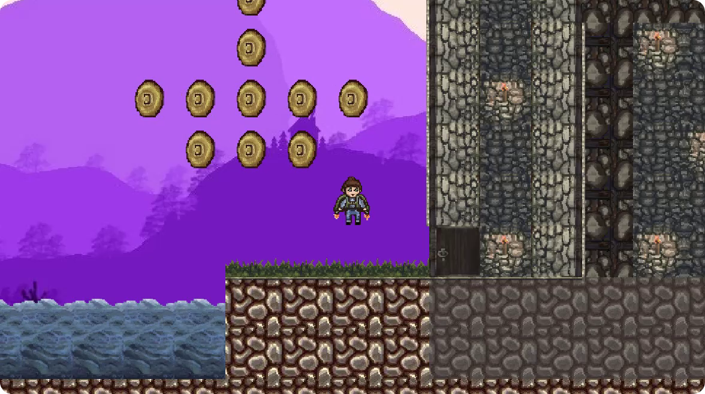

# Dimon Run
  

**Dimon Run** is a platformer-like game written in C++ using the Entity Component System architechture and [Qt](https://www.qt.io) by DreamTeam.

The game is a study project of Belarusian State University first year students (March - May 2022).

DreamTeam members:

* Yahor Tiliguzov([@tiliguzov](https://github.com/tiliguzov))
* Ilya Shatnov([@ManFormTheMoon](https://github.com/ManFormTheMoon))
* Christina Sivakova([@CCivakova](https://github.com/CCivakova))
* Michail Semenov([@Marmotikon](https://github.com/Marmotikon))

Advisers:

* Yahor Khadasevich ([@Khody31](https://github.com/Khody31))
* Maxim Miasoedenkov([@ternerss](https://github.com/ternerss))
* Maxim Litskevich([@Zzzabiyaka](https://github.com/Zzzabiyaka))

The best artist who never once refused to help:

* Elizabeth Ilyina

## Description

The player is invited to be a scientist of the future, who created a jetpack time machine, which goes to the past in search of easy earnings. To get to the treasure, he will have to use his wits. He might not succeed from the first time, but with his invention he can get to the same point in time an unlimited number of times.

The game also includes the ability to create your own levels, and immediately play them.

|  |

## Development status

Development started in March 2022 and completed in May 2022.

## Build

If you want to work with the project in CLion, you need to clone the repository. 
Then you need to edit the file *CMakeLists.txt*.
Add the line describing the path to CMake config files contained in Qt.
For example:

`set(CMAKE_PREFIX_PATH "~/Qt/5.15.2/gcc_64/lib/cmake)` for Linux 
 
`set(CMAKE_PREFIX_PATH "C:/Qt/Qt5.13.0/5.13.0/mingw73_64/lib/cmake")` for Windows

If your OS is Linux, work is done. Otherwise you have to add path to Qt libraries and compiler into *Path*.
For exmample:

`C:\Qt\Tools\mingw810_64\bin`

`C:\Qt\5.15.2\mingw81_64\bin`

After that you need to reboot your Windows.
